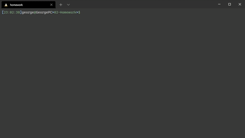

[](http://www.wtfpl.net/about/)
# team-profile-generator


created by: Pastashock

reach me: gpastushok@yahoo.com

github pages: 

github URL: https://github.com/PastaShock/team-profile-generator


## Table of Contents
- [about](#about)
- [Installation](#Installation)
- [usage](#Usage)
- [contribution](#Contribution)
- [testing](#testing)
- [license](#license)

## About

### Why did I make this project?
This project exists to as an excercise in taking data into my code in a fixed, programmatic way and storing it to be manipulated later. I also did a lot of requires and exports in this excercise.



### What makes this app standout?
This project stands out because I made it.

## Installation
```npm i```

## Usage

This project can be used as a rudimentary front end for data or as an expressjs template.

## Contribution
don't

## Testing
```npm test```

## License
This project is using [](http://www.wtfpl.net/about/)

    